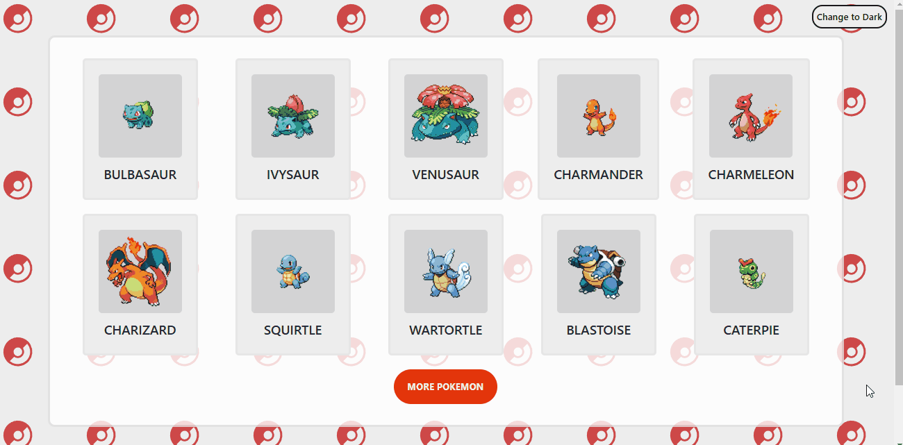

# DevQuest - Essa é a minha solução para a QUEST de react avançado.

Para testar meu domínio nos conceitos apresentados no módulo de React avançado me foi proposto este desafio, fazer uma página com uma lista de 10 pokemon com um botão para adicionar mais 10 a lista, e uma página única para cada pokemon.
- Usando a [PokeAPI](https://pokeapi.co/)

## Conteúdos

- [Funcionalidades](#funcionalidades)
  - [Ferramentas](#ferramentas)
  - [Gif](#gif)
  - [Links](#links)
- [Meu processo](#meu-processo)
  - [Feito com](#feito-com)
  - [Inicializar o projeto](#inicializar-o-projeto)
- [Autor](#autor)

### Funcionalidades

- Adição de 10 pokemon a lista ao clicar em "More pokemon"
- Botão para mudar o tema da aplicação
- Ao clicar no card do pokemon abrir uma página com suas informações detalhadas

### Ferramentas 

No projeto foram utilizadas as seguintes ferramentas:

- Vite => Permite a inicialização rápida do projeto
- Context API => Usado para guarda informações para utilização em vários pontos da aplicação.
- React Router => Possibilita a navegação entre componentes
- React query => Melhora a interação com algumas requisições a API
- Styled components => Possibilita a estilização do componente no próprio arquivo do componente.

### Gif

### Links

- Link da minha solução [Repositório GitHub](https://github.com/Leandro-Sousa-dev/react-pokedex)

## Meu processo

#### 1° - Passo: 

Listar 10 pokemon

- Planejamento:
Comecei lendo a documentação da PokeAPI, ao ler como seria o retorno da requisição comecei a anotar os pontos de interesse da requisição, coloquei em prática a primeira etapa do projeto fazer a lista com os 10 pokemon.

- Execução:
Para melhor interação com o fetch fiz um custom hook para usar com react query, peguei a imagem com menor qualidade para que o carregamento não fosse muito demorado, para pegar a imagem do pokemon exato extrai o "id" de cada pokemon com o link da requisição.

#### 2° - Passo

Adicionar 10 pokemon a lista

- Planejamento:
Enquanto planejava como adicionar mais 10 pokemon a lista, optei por utilizar um contexto para armazenar a informação da quantidade atual de pokemon na lista.

- Execução:
Usando o contexto com a quantidade atual ficou fácil guardar a quantidade para as requisições.

#### 3° - Passo

Mostrar detalhes do pokemon

- Planejamento:
Como já tinha lido na documentação que podemos usar o nome do pokemon para fazer a requisição de seus detalhes, e usar mais uma vez, custom hook, react query.

- Execução: 
Para as demais informações não tive dificuldades, porém as habilidades precisavam de mais uma requisição e eram uma lista então tive certa dificuldade até chegar a um componente com useEffect.

### Inicializar o projeto

`npm install`  

### Feito com

- Vite
- React
- JavaScript
- Tags HTML5 semâticas 
- Styled components
- React Router
- React Query
- CSS flex
- PokeAPI

 

## Autor

- GitHub - [Leandro-Sousa-dev](https://github.com/Leandro-Sousa-dev)
- Frontend Mentor - [@Leandro-Sousa-dev](https://www.frontendmentor.io/profile/Leandro-Sousa-dev)
- LinkedIn - [José Leandro](https://www.linkedin.com/in/jos%C3%A9-leandro-7ba007261/)

